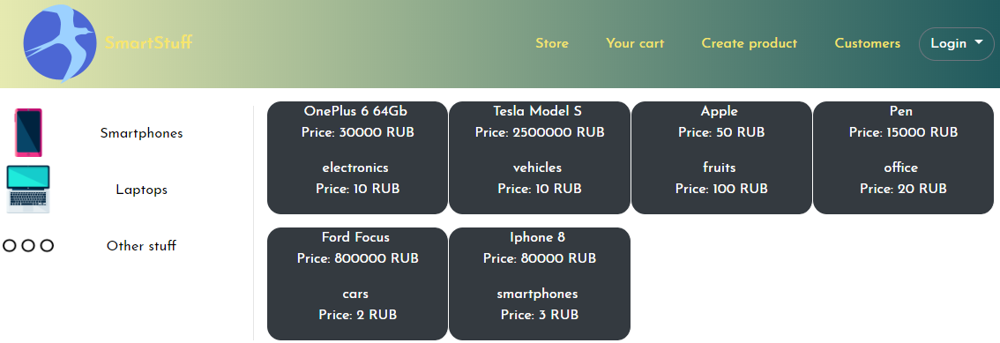
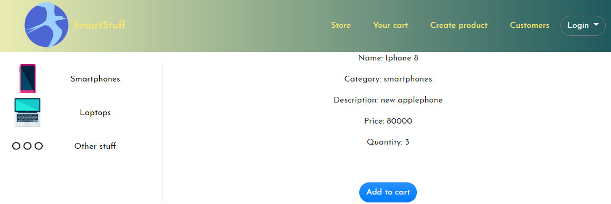
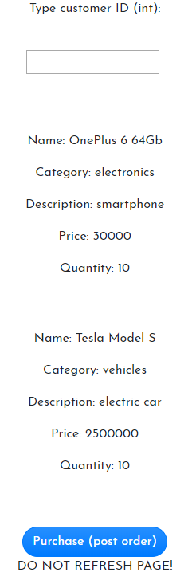
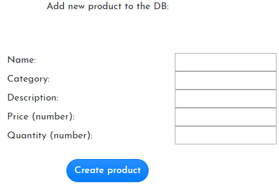
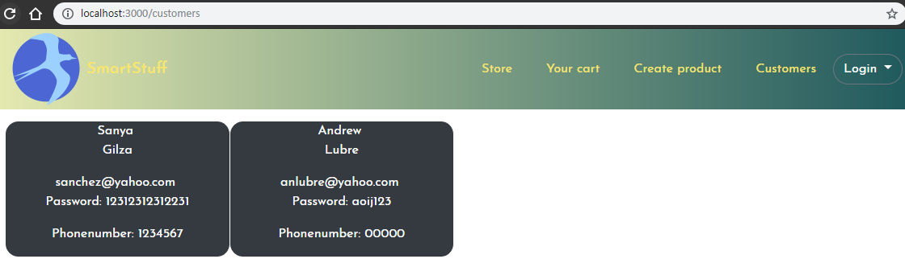
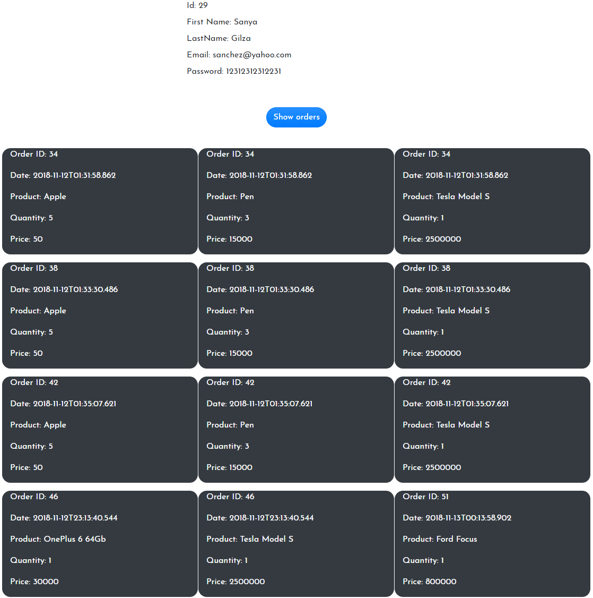
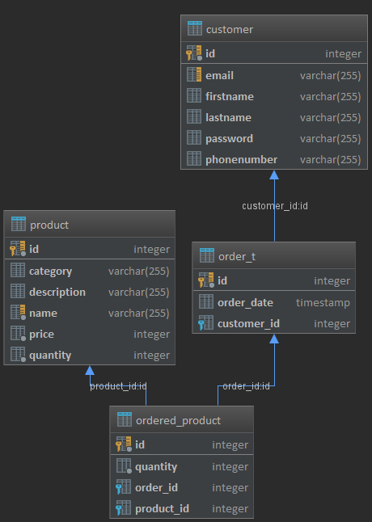

# Website Market on Spring Boot and ReactJS

This project was developed for studying purposes of current technologies. 

## Technologies and Patterns

* [Spring Boot](http://spring.io/projects/spring-boot) - stand-alone, production-grade Spring based application creator
* [Hibernate](http://hibernate.org/), [Spring Data JPA](http://spring.io/projects/spring-data-jpa#overview) - access to database data
* [PostgreSQL](https://www.postgresql.org/) - database
* [ReactJS](https://reactjs.org/), [Bootstrap 4](https://getbootstrap.com/) - UI web interface
* [Redux](https://redux.js.org/) - State Container for JavaScript apps
* [React Router](https://reacttraining.com/react-router/web/guides/quick-start) - library for routing URLs in React
* [Axios](https://github.com/axios/axios) - JS library for http requests
* [Maven](https://maven.apache.org/) - Dependency Management
* [Tomcat](http://tomcat.apache.org/) - Servlet Container
* REST style web service


## Getting Started

These instructions will get you a copy of the project up and running on your local machine for testing purposes. 

### Installing

Import a Maven Project from existing pom.xml file in root directory.

Then go to 
```
src/main/java/com/studying/web/frontend
```
 and run in the command line
```
npm install
```

[Optional] You can build react app by running 
```
npm run build
```

and copy created 'build' folder to 
```
src/main/resources
```
folder.

## Running the project
If you copied 'build' folder to 'resource' directory as explained before, you can just run at this moment WebApplication.
If not, you need to run react app and Spring Boot Application separately:

React App in folder 'frontend' starts by typing in command line:
```
npm start
```
WebApplication class with method main is located at 
```
src/main/java/com/studying/web
```

You can see the result at home page:
```
http://localhost:3000
```

## Website functionality

* Navigation bar on the top of all pages  

* Visual presentation of dynamically loaded products on responsible store page  

* Product page where you can add this item to your cart  

* Cart page where user can see added items and send a request to the server for creating new order  

* Page for creating new product in database  

* Page of all dynamically loaded customers

* Customer page with all information about customer and his orders (by click)  



## Database
Here is a presentation of database diagram  



## REST web service
Data exchange between the client and the web service of the website is in JSON format.

Client requests (such GET all products, GET product details or customer's orders, POST new product or customer and etc.) 
are handled by Axios JS library.


## ReactJS components
Website is divided into stateless or presentational components (like a NavBar, ToolBar, Home 
and other stateless components for their container-components) 
and container components with logic inside (at frontend/src/components). 
All container components use redux store for managing needed state.
